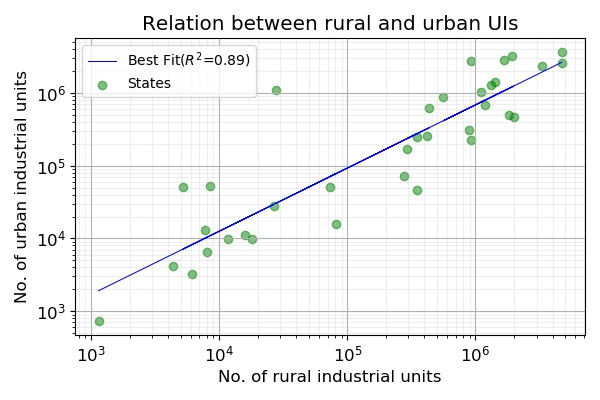
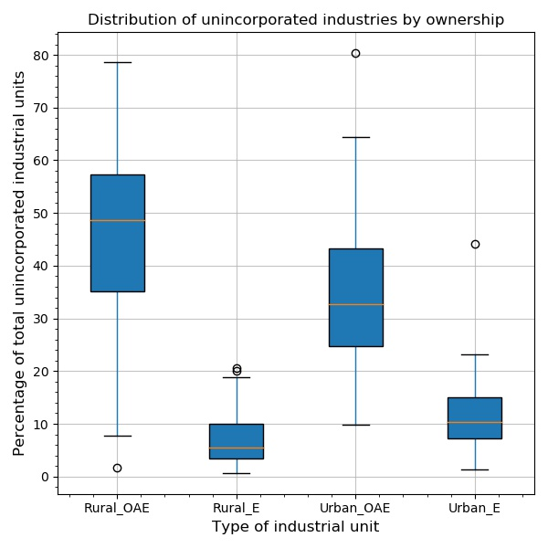

# DS200: Research Methods(Module 4)

## Submission for Assignment

> ** Analysis and Visualization of a Dataset **

The dataset used in this report is 'Estimated number of enterprises in different States/UTs' from www.data.gov.in. The link to the dataset is <a href="https://data.gov.in/resources/estimated-number-enterprises-different-statesuts">[1]. This presents the estimated number of unincorporated non-agricultural enterprises in different States and UTs. An unincorporated industrial unit is a production unit that is not registered as a legal entity separate from the owner. In the plots, the term unincorporated industry is abbreviated as UI.

## Documentation
1. The file ```analysis.py``` conains the script to generate the plots.
2. The plots are located in ```plots/```.
3. The dataset is located in the form of a .xls file in the folder ```datasets/```.
4. The libraries used are ```numpy```, ```pandas```, ```scipy``` and ```matplotlib```. 

## Analysis

### Scatter Plot


Upon plotting the number of UIs in rural and urban areas in the linear scale, the data was very much scattered. So, when the plot was generated using a logarithmic scale, correlation was observed. So, when linear fit was conducted for the logarithm of both the parameters, the obtained line of best fit had an R^2 value of 0.89. This shows that the number of UIs in urban areas rises exponentially in comparison to the number of UIs for a state in the rural region.

### Bar Graph


The bar graph shows the number of UIs in each state in the rural and urban areas. The largest number of UIs were located in UP and the smallest number of UIs were located in Lakshadweep.

### Box Plot


For reference, the term Rural_OAE stands for Rural Own Account Enterprises and Rural_E stands for Rural Establishment. While comparing the number UIs that are OAEs or establishments for all states won't be a fair comparison, so the values were normalized using the total number of UIs in each state/union territory. It can be observed that the median values of the percentage of UIs  as OAEs was larger than the percentage of UIs as establishments for both rural and urban regions. Considering the way in which the data is spread, the difference between the third quartile and the first quartile depends upon the type of industrial unit. A few outliers have been observed in each of the four categories.

### Conclusion
To summarize the results, a logarithmic relation between the rural and urban UIs in each state was obtained. It was noted that the states with high population have larger number of UIs and the manner in which the number of UIs in rural/urban region were spread as a fraction of the total number of UIs for a state depended on its ownership.

### References
<b id="my_anchor">[1].</b> Estimated number of enterprises in different States/UTs(https://data.gov.in/resources/estimated-number-enterprises-different-statesuts).
